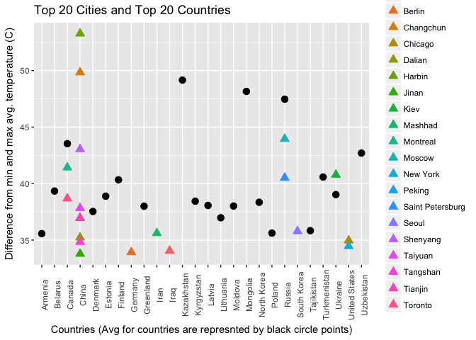

Case Study 2
================
Jonathan Knowles, Michael Crowder, Nadezhda Green
4/23/2017

Introduction
------------

##### This case study presents us with 3 tasks in which we will outline in the sections contained in this document. The first task is to replicate a matrix in R, Python and SAS. Our second task has our group using orange tree data to examine the size of trunks and visualizing the data in various methods. The third task sets us upon a dataset of global temperature since the 1800’s with multiple date formats. We are asked several questions that require us to clean, analyze and visualize the data. Concluding the Case Study we will offer a conclusion between the two data sets that are created from our third task. For detailed code commenting please see the case\_study\_2.Rmd file.

#### Install Packages and Load Libraries - if you already have these Packages installed and loaded you may skip this step.

``` r
source("install_load.R", print.eval = TRUE)
```

    ## 
    ## The downloaded binary packages are in
    ##  /var/folders/wz/910_s_x97vs8hrw8gnjc98g80000gn/T//RtmpMI7lV1/downloaded_packages
    ## 
    ## The downloaded binary packages are in
    ##  /var/folders/wz/910_s_x97vs8hrw8gnjc98g80000gn/T//RtmpMI7lV1/downloaded_packages
    ## 
    ## The downloaded binary packages are in
    ##  /var/folders/wz/910_s_x97vs8hrw8gnjc98g80000gn/T//RtmpMI7lV1/downloaded_packages
    ## 
    ## The downloaded binary packages are in
    ##  /var/folders/wz/910_s_x97vs8hrw8gnjc98g80000gn/T//RtmpMI7lV1/downloaded_packages
    ## 
    ## The downloaded binary packages are in
    ##  /var/folders/wz/910_s_x97vs8hrw8gnjc98g80000gn/T//RtmpMI7lV1/downloaded_packages
    ## 
    ## The downloaded binary packages are in
    ##  /var/folders/wz/910_s_x97vs8hrw8gnjc98g80000gn/T//RtmpMI7lV1/downloaded_packages
    ## 
    ## The downloaded binary packages are in
    ##  /var/folders/wz/910_s_x97vs8hrw8gnjc98g80000gn/T//RtmpMI7lV1/downloaded_packages

    ## Warning in doTryCatch(return(expr), name, parentenv, handler): unable to load shared object '/Library/Frameworks/R.framework/Resources/modules//R_X11.so':
    ##   dlopen(/Library/Frameworks/R.framework/Resources/modules//R_X11.so, 6): Library not loaded: /opt/X11/lib/libSM.6.dylib
    ##   Referenced from: /Library/Frameworks/R.framework/Resources/modules//R_X11.so
    ##   Reason: image not found

### 2.

##### a) Calculate the mean and the median of the trunk circumferences for different size of the trees. (Tree)

#### We get the mean and median trunk circumference for the types of trees.

``` r
source("Q2_Orange.R", print.eval = TRUE, echo = FALSE)
```


### 3.

#### Part(i) Find the difference between the maximum and the minimum monthly average temperatures for each country and report/visualize top 20 countries with the maximum differences for the period since 1900.

``` r
source("part_i.R", print.eval = TRUE, echo = FALSE)
```

    ##          Country AvgMaxTemp AvgMinTemp AvgMaxMinDiff
    ## 115   Kazakhstan     25.562    -23.601        49.163
    ## 144     Mongolia     20.716    -27.442        48.158
    ## 180       Russia     16.893    -30.577        47.470
    ## 39        Canada     14.796    -28.736        43.532
    ## 234   Uzbekistan     30.375    -12.323        42.698
    ## 225 Turkmenistan     32.136     -8.443        40.579
    ## 75       Finland     19.132    -21.200        40.332
    ## 22       Belarus     22.811    -16.527        39.338
    ## 228      Ukraine     24.297    -14.724        39.021
    ## 68       Estonia     22.332    -16.551        38.883
    ## 120   Kyrgyzstan     19.275    -19.161        38.436
    ## 160  North Korea     23.952    -14.390        38.342
    ## 122       Latvia     22.279    -15.784        38.063
    ## 142      Moldova     25.231    -12.781        38.012
    ## 88     Greenland      0.339    -37.658        37.997
    ## 58       Denmark      0.699    -36.830        37.529
    ## 128    Lithuania     21.791    -15.179        36.970
    ## 216   Tajikistan     19.363    -16.466        35.829
    ## 174       Poland     22.509    -13.107        35.616
    ## 11       Armenia     25.291    -10.275        35.566


#### Part (ii) a, b, and c. For part c we get an *answer of 1.865 degrees that happened in 2012 to 2013*

``` r
source("part_ii.R", print.eval = TRUE, echo = TRUE)
```

    ## 
    ## > TempData = read.csv("TEMP.csv")
    ## 
    ## > USTemp <- TEMPData
    ## 
    ## > USTemp <- subset(USTemp, Country == "United States")
    ## 
    ## > USTemp <- USTemp[-c(1:2656), ]
    ## 
    ## > library(weathermetrics)
    ## 
    ## > USTemp$Monthly.AverageTempFahrenheit <- celsius.to.fahrenheit(USTemp$Monthly.AverageTemp, 
    ## +     round = 3)
    ## 
    ## > DateTesting <- USTemp
    ## 
    ## > DateTesting$FormattedDate <- as.Date(DateTesting$Date, 
    ## +     format = "%m/%d/%Y")
    ## 
    ## > DateTesting$Month <- months(DateTesting$FormattedDate)
    ## 
    ## > library(lubridate)
    ## 
    ## > DateTesting$Year <- year(DateTesting$FormattedDate)
    ## 
    ## > landTemp <- aggregate(DateTesting$Monthly.AverageTempFahrenheit ~ 
    ## +     DateTesting$Year, DateTesting, function(x) mean(x))
    ## 
    ## > landTemp$Monthly.AverageTempFahrenheitDifference <- c(NA, 
    ## +     round(diff(landTemp$`DateTesting$Monthly.AverageTempFahrenheit`), 
    ## +         digits .... [TRUNCATED] 
    ## 
    ## > landTemp$`DateTesting$Monthly.AverageTempFahrenheit` <- NULL
    ## 
    ## > landTemp <- rename(landTemp, c(`DateTesting$Year` = "Year", 
    ## +     Monthly.AverageTempFahrenheitDifference = "AverageTemperatureDifferenceFromPrevio ..." ... [TRUNCATED] 
    ## 
    ## > landTemp <- arrange(landTemp, -landTemp$AverageTemperatureDifferenceFromPreviousYear)
    ## 
    ## > landTemp[1, ]
    ##   Year AverageTemperatureDifferenceFromPreviousYear
    ## 1 2013                                        1.865
    ## 
    ## > landTemp <- aggregate(DateTesting$Monthly.AverageTempFahrenheit ~ 
    ## +     DateTesting$Year, DateTesting, function(x) mean(x))
    ## 
    ## > ggplot(data = landTemp, aes(x = landTemp$`DateTesting$Year`, 
    ## +     y = landTemp$`DateTesting$Monthly.AverageTempFahrenheit`, 
    ## +     group = 1)) + g .... [TRUNCATED]


#### Part (iii) Download “CityTemp” data set at box.com. Find the difference between the maximum and the minimum temperatures for each major city and report/visualize top 20 cities with maximum differences for the period since 1900.

``` r
source("part_iii.R", print.eval = TRUE, echo = TRUE)
```

    ## 
    ## > CityTempData <- read.csv("CityTemp.csv")
    ## 
    ## > CityTempData$FormattedDate <- as.Date(CityTempData$Date, 
    ## +     format = "%m/%d/%Y")
    ## 
    ## > CityTempData$Month <- months(CityTempData$FormattedDate)
    ## 
    ## > CityTempData$Year <- year(CityTempData$FormattedDate)
    ## 
    ## > CityTempData <- CityTempData[order(CityTempData$Year), 
    ## +     ]
    ## 
    ## > CityTempData <- CityTempData[complete.cases(CityTempData[, 
    ## +     10]), ]
    ## 
    ## > CityTempDataAvgMin <- aggregate(CityTempData$Monthly.AverageTemp ~ 
    ## +     CityTempData$City, TEMPData, function(x) min(x))
    ## 
    ## > CityTempDataAvgMax <- aggregate(CityTempData$Monthly.AverageTemp ~ 
    ## +     CityTempData$City, TEMPData, function(x) max(x))
    ## 
    ## > CityTempDataAvgMinANDMaxTemp <- merge(CityTempDataAvgMax, 
    ## +     CityTempDataAvgMin, by = 1)
    ## 
    ## > CityTempDataAvgMinANDMaxTemp$AvgMaxMinDiff <- CityTempDataAvgMinANDMaxTemp$`CityTempData$Monthly.AverageTemp.x` - 
    ## +     CityTempDataAvgMinANDMaxTem .... [TRUNCATED] 
    ## 
    ## > CityTempDataAvgMinANDMaxTemp <- rename(CityTempDataAvgMinANDMaxTemp, 
    ## +     c(`CityTempData$City` = "City", `CityTempData$Monthly.AverageTemp.x` = " ..." ... [TRUNCATED] 
    ## 
    ## > CityTempDataAvgMinANDMaxTemp <- CityTempDataAvgMinANDMaxTemp[order(CityTempDataAvgMinANDMaxTemp$AvgMaxMinDiff, 
    ## +     decreasing = TRUE), ]
    ## 
    ## > CityTempDataAvgMinANDMaxTemp <- CityTempDataAvgMinANDMaxTemp[order(-CityTempDataAvgMinANDMaxTemp$AvgMaxMinDiff), 
    ## +     ][1:20, ]
    ## 
    ## > CityTempDataAvgMinANDMaxTemp[, "Country"] <- NA
    ## 
    ## > CityTempDataAvgMinANDMaxTemp$Country <- CityTempData$Country[match(CityTempDataAvgMinANDMaxTemp$City, 
    ## +     CityTempData$City)]
    ## 
    ## > ggplot(data = CityTempDataAvgMinANDMaxTemp, aes(x = City, 
    ## +     y = AvgMaxMinDiff, group = 1, color = City)) + geom_point(size = 3) + 
    ## +     theme( .... [TRUNCATED]


#### Part(iv) Compare the two graphs in (i) and (iii) and comment it.

#### What we find these two graphs is that we have countries that are large and contain many different climate zones like China and Canada and the United States. Inland areas in what is called the Grasslands Biome - Midlatitude Climates (Bs) in the Koppen Climate Classification System can have extreme temperatures in both winter months and summer months. For more information on the Koppen Climate Classifications see <http://www.thesustainabilitycouncil.org/resources/the-koppen-climate-classification-system/>

``` r
source("part_iv.R", print.eval = TRUE, echo = TRUE)
```

    ## 
    ## > CityTempDataAvgMinANDMaxTemp
    ##                City AvgMaxTemp AvgMinTemp AvgMaxMinDiff       Country
    ## 34           Harbin     26.509    -26.772        53.281         China
    ## 19        Changchun     26.572    -23.272        49.844         China
    ## 65           Moscow     24.580    -19.376        43.956        Russia
    ## 86         Shenyang     26.010    -17.035        43.045         China
    ## 64         Montreal     23.059    -18.363        41.422        Canada
    ## 48             Kiev     24.593    -16.191        40.784       Ukraine
    ## 79 Saint Petersburg     21.921    -18.589        40.510        Russia
    ## 96          Toronto     23.181    -15.502        38.683        Canada
    ## 92          Taiyuan     24.718    -13.116        37.834         China
    ## 73           Peking     28.936     -8.017        36.953         China
    ## 94          Tianjin     28.936     -8.017        36.953         China
    ## 84            Seoul     26.791     -8.992        35.783   South Korea
    ## 60          Mashhad     27.226     -8.384        35.610          Iran
    ## 24           Dalian     25.875     -9.348        35.223         China
    ## 21          Chicago     26.372     -8.590        34.962 United States
    ## 93         Tangshan     27.346     -7.487        34.833         China
    ## 71         New York     25.313     -9.147        34.460 United States
    ## 6           Baghdad     38.283      4.236        34.047          Iraq
    ## 10           Berlin     23.795    -10.125        33.920       Germany
    ## 43            Jinan     28.389     -5.389        33.778         China
    ## 
    ## > ggplot() + geom_point(data = AvgMinANDMaxTempByDiffTop20, 
    ## +     aes(x = Country, y = AvgMaxMinDiff), show.legend = TRUE, 
    ## +     size = 3, shape = 1 .... [TRUNCATED]


