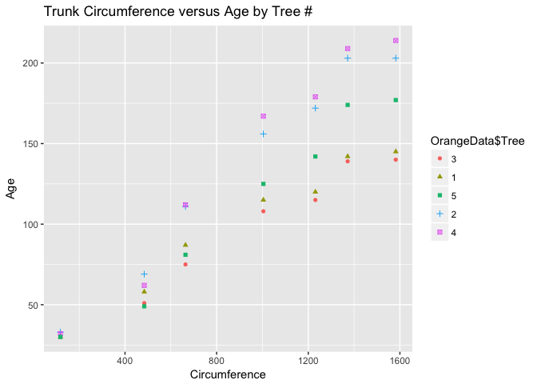
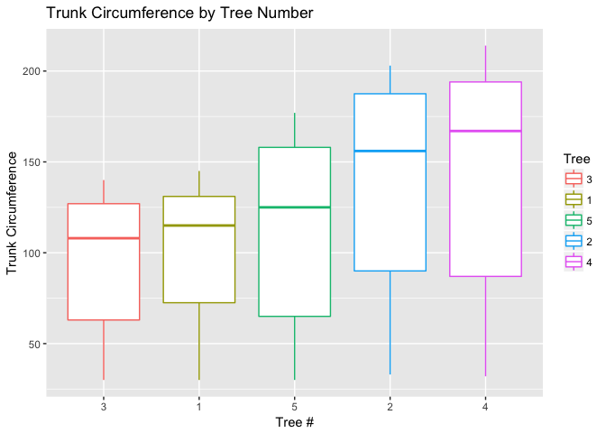
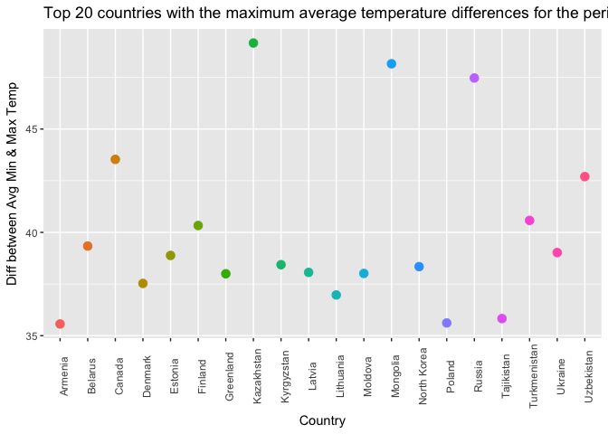
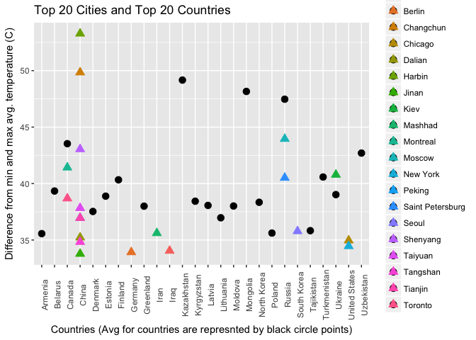

Case\_Study\_2
================
Jonathan Knowles, Michael Crowder, Nadezhda Green
4/19/2017

Introduction
------------

##### This case study presents us with 3 tasks in which we will outline in the sections contained in this document. The first task is to replicate a matrix in R, Python and SAS. Our second task has our group using orange tree data to examine the size of trunks and visualizing the data in various methods. The third task sets us upon a dataset of global temperature since the 1800’s with multiple date formats. We are asked several questions that require us to clean, analyze and visualize the data. Concluding the Case Study we will offer a conclusion between the two data sets that are created from our third task.

### 1. Create the X matrix and print it from SAS, R, and Python.

##### First we will demonstrate in R

``` r
X = matrix(c(4, 1, 2, 5, 0, 1, 1, 3, 8, 2, 5, 2), nrow = 3, ncol = 4)
X
```

    ##      [,1] [,2] [,3] [,4]
    ## [1,]    4    5    1    2
    ## [2,]    1    0    3    5
    ## [3,]    2    1    8    2

##### Below is Python

``` python
X = [[4,5,1,2],
     [1,0,3,5],
     [2,1,8,2]]
     
print('\n'.join([''.join(['{:3}'.format(item) for item in row])
                 for row in X]))
```

    ##   4  5  1  2
    ##   1  0  3  5
    ##   2  1  8  2

##### Below is SAS

proc iml; X = {4 5 1 2,
1 0 3 5,
2 1 8 2};

print(X);
quit;

##### Which results with the following output in SAS On Demand:


### 2.

##### a) Calculate the mean and the median of the trunk circumferences for different size of the trees. (Tree)

#### *We get the mean and median trunk circumference for the types of trees.*


``` r
OrangeData <- Orange
# If you dont have  the package sqldf already installed please install the package using #
#install.packages("sqldf")
#load the library#
library(sqldf)

#We are going to use SQL to get answer to part A #
sqldf("Select Tree, avg(circumference), median(circumference) from OrangeData group by Tree")
```

    ##   Tree avg(circumference) median(circumference)
    ## 1    1           99.57143                   115
    ## 2    2          135.28571                   156
    ## 3    3           94.00000                   108
    ## 4    4          139.28571                   167
    ## 5    5          111.14286                   125

#### b. Make a scatter plot of the trunk circumferences against the age of the tree. Use different plotting symbols for different size of trees. We can gather from the below scatter plot that we a relationship between age and the circumference of the trees in this data set.

``` r
# If you don't already have ggplot2 please install #
# install.packages('ggplot2')# With the below plot we are looking for a
# relationship between the circumference of the tree trunk and the age of
# the tree. #
library(ggplot2)
qplot(x = OrangeData$age, y = OrangeData$circumference, shape = OrangeData$Tree, 
    xlab = "Circumference", ylab = "Age", main = "Trunk Circumference versus Age by Tree #", 
    color = OrangeData$Tree)
```



#### c. Display the trunk circumferences on a comparative boxplot against tree. Be sure you order the boxplots in the increasing order of maximum diameter. We can see simular results as the above the scatter plot with the distributions of tree numbers 1 and 3 being very simular compared to trees 5, 2, and four which have distributions that exibit larger trunk circumference.

``` r
# For the boxplot we use ggplot to generate Truck Circumference by Tree
# using different colors by tree #
ggplot(data = OrangeData, aes(x = Tree, y = circumference, group = Tree)) + 
    geom_boxplot(aes(color = Tree)) + labs(x = "Tree #", y = "Trunk Circumference", 
    title = "Trunk Circumference by Tree Number")
```



### 3.

#### (i) Find the difference between the maximum and the minimum monthly average temperatures for each country and report/visualize top 20 countries with the maximum differences for the period since 1900.

#### *The top 20 countries with maximum differences for the period are: Kazakhstan, Mongolia, Russia, Canada, Uzbekistan, Turkmenistan, Finland, Belarus, Ukraine, Estonia, Kyrgyzstan, North Korea, Lativa, Moldova, Greenland, Denmark, Lithuania, Tajikistan, Poland, Armenia*

``` r
# We read in the data set that has already been downloaded from box.com #
TEMPData <- read.csv("TEMP.csv")
# Here we parse the data to what we need #
TEMPDataSince1900 <- TEMPData[nrow(TEMPData):1, ]
```

#### For the below part we will start to clean this data set.

``` r
# If you don't already have the package lubridate please install by taking
# the '#' off # install.packages('lubridate') load the library #
library(lubridate)
```

    ## 
    ## Attaching package: 'lubridate'

    ## The following object is masked from 'package:base':
    ## 
    ##     date

``` r
# Remove the NA's in this dataset #
TEMPDataC <- na.omit(TEMPData)
# These two lines will gives us the variables for temp min and max #
AvgTempMin <- aggregate(TEMPData$Monthly.AverageTemp ~ TEMPData$Country, TEMPData, 
    function(x) min(x))
AvgTempMax <- aggregate(TEMPData$Monthly.AverageTemp ~ TEMPData$Country, TEMPData, 
    function(x) max(x))
# If you don't already have the package plyr please install by taking the
# '#' off #

# install.packages('plyr')
library(plyr)
```

    ## 
    ## Attaching package: 'plyr'

    ## The following object is masked from 'package:lubridate':
    ## 
    ##     here

``` r
# We then merge the Min and Max data #
AvgMinANDMaxTemp <- merge(AvgTempMax, AvgTempMin, by = 1)
# Continuing the tidying process we take the AvgMinANDMaxTemp and name the
# column names #
AvgMinANDMaxTemp <- rename(AvgMinANDMaxTemp, c(`TEMPData$Country` = "Country", 
    `TEMPData$Monthly.AverageTemp.x` = "AvgMaxTemp", `TEMPData$Monthly.AverageTemp.y` = "AvgMinTemp"))
```

#### Now we can begin the process of answering the question since we have cleaned our data.

``` r
# With the below line of code, we take the difference of the min and max #
AvgMinANDMaxTemp$AvgMaxMinDiff <- AvgMinANDMaxTemp$AvgMaxTemp - AvgMinANDMaxTemp$AvgMinTemp
# This line sets the order of the difference to prepare for the seperation
# of the top 20 countries #
AvgMinANDMaxTempByDiff <- AvgMinANDMaxTemp[order(AvgMinANDMaxTemp$AvgMaxMinDiff, 
    decreasing = TRUE), ]
# Here we accomplish the actual seperation of the top 20 countries with the
# max differences since 1900 #
AvgMinANDMaxTempByDiffTop20 <- AvgMinANDMaxTempByDiff[order(-AvgMinANDMaxTempByDiff$AvgMaxMinDiff), 
    ][1:20, ]
```

#### What we find when when we display the table and the plot is that countries that are located in regions of geography that have a warm or hot summer and a cool or cold winter will see the highest movement in temperature. Some of the countries listed below are large physically and will have a multitude of different climates like Russia, Mongolia and Kazakhstan.

``` r
# We simply display the varible below to get our table of the largest
# variations in tempeture by country.
AvgMinANDMaxTempByDiffTop20
```

    ##          Country AvgMaxTemp AvgMinTemp AvgMaxMinDiff
    ## 115   Kazakhstan     25.562    -23.601        49.163
    ## 144     Mongolia     20.716    -27.442        48.158
    ## 180       Russia     16.893    -30.577        47.470
    ## 39        Canada     14.796    -28.736        43.532
    ## 234   Uzbekistan     30.375    -12.323        42.698
    ## 225 Turkmenistan     32.136     -8.443        40.579
    ## 75       Finland     19.132    -21.200        40.332
    ## 22       Belarus     22.811    -16.527        39.338
    ## 228      Ukraine     24.297    -14.724        39.021
    ## 68       Estonia     22.332    -16.551        38.883
    ## 120   Kyrgyzstan     19.275    -19.161        38.436
    ## 160  North Korea     23.952    -14.390        38.342
    ## 122       Latvia     22.279    -15.784        38.063
    ## 142      Moldova     25.231    -12.781        38.012
    ## 88     Greenland      0.339    -37.658        37.997
    ## 58       Denmark      0.699    -36.830        37.529
    ## 128    Lithuania     21.791    -15.179        36.970
    ## 216   Tajikistan     19.363    -16.466        35.829
    ## 174       Poland     22.509    -13.107        35.616
    ## 11       Armenia     25.291    -10.275        35.566

``` r
# With plotting this data we want to display the difference between the Avg
# Min and Max Temp by the top 20 countries #
ggplot(data = AvgMinANDMaxTempByDiffTop20, aes(x = AvgMinANDMaxTempByDiffTop20$Country, 
    y = AvgMinANDMaxTempByDiffTop20$AvgMaxMinDiff, color = AvgMinANDMaxTempByDiffTop20$Country)) + 
    geom_point(size = 3, show.legend = FALSE) + theme(axis.text.x = element_text(angle = 90)) + 
    ggtitle("Top 20 countries with the maximum average temperature differences for the period since 1900") + 
    xlab("Country") + ylab("Diff between Avg Min & Max Temp")
```



#### (ii) Select a subset of data called “UStemp” where US land temperatures from 01/01/1990 in Temp data. Use UStemp dataset to answer the following

``` r
# Bring in the data again for TEMP.csv #
TempData = read.csv("TEMP.csv")
# We change the dataset name to prep for subsetting out the US Data #
USTemp <- TEMPData
# Here we subset the US data out #
USTemp <- subset(USTemp, Country == "United States")
# We isolate the US Temp from 1990 #
USTemp <- USTemp[-c(1:2656), ]
# If you don't already have the package 'weathermetrics' please install by
# taking the '#' off # install.packages('weathermetrics') load the library #
library(weathermetrics)
# We use the weathermetrics package to execute the function to convert the
# celsisus to fahrenheit and answer part a #
USTemp$Monthly.AverageTempFahrenheit <- celsius.to.fahrenheit(USTemp$Monthly.AverageTemp, 
    round = 3)
```

#### This next part will help us answer both b and c. When we look at the *answer that c gives us which is from 2012 to 2013 the average temp increased 1.865 that is a large increase when we look at the other years on the plot.*

``` r
DateTesting <- USTemp
# We are simply formating the dates into one format #
DateTesting$FormattedDate <- as.Date(DateTesting$Date, format = "%m/%d/%Y")

DateTesting$Month <- months(DateTesting$FormattedDate)
# If you don't already have the package 'lubridate' please install by taking
# the '#' off # install.packages('lubridate')

library(lubridate)
# Here we start tidying the data by cleaning the dates #
DateTesting$Year <- year(DateTesting$FormattedDate)
# These
landTemp <- aggregate(DateTesting$Monthly.AverageTempFahrenheit ~ DateTesting$Year, 
    DateTesting, function(x) mean(x))

landTemp$Monthly.AverageTempFahrenheitDifference <- c(NA, round(diff(landTemp$`DateTesting$Monthly.AverageTempFahrenheit`), 
    digits = 3))

landTemp$`DateTesting$Monthly.AverageTempFahrenheit` <- NULL

landTemp <- rename(landTemp, c(`DateTesting$Year` = "Year", Monthly.AverageTempFahrenheitDifference = "AverageTemperatureDifferenceFromPreviousYear"))

landTemp <- arrange(landTemp, -landTemp$AverageTemperatureDifferenceFromPreviousYear)

landTemp[1, ]
```

    ##   Year AverageTemperatureDifferenceFromPreviousYear
    ## 1 2013                                        1.865

#### b.) Calculate average land temperature by year and plot it. The original file has the average land temperature by month.

``` r
# Here we create the landTemp variable in which we will answer part b as
# well as plot the information #
landTemp <- aggregate(DateTesting$Monthly.AverageTempFahrenheit ~ DateTesting$Year, 
    DateTesting, function(x) mean(x))

ggplot(data = landTemp, aes(x = landTemp$`DateTesting$Year`, y = landTemp$`DateTesting$Monthly.AverageTempFahrenheit`, 
    group = 1)) + geom_line() + geom_point(aes(color = landTemp$`DateTesting$Year`)) + 
    labs(x = "Year", y = "Avg. Temp. in F", title = "Average Land Temperature by Year since 1990") + 
    scale_x_continuous(breaks = round(seq(min(landTemp$`DateTesting$Year`), 
        max(landTemp$`DateTesting$Year`), by = 1), 1)) + theme(axis.text.x = element_text(angle = 90)) + 
    guides(colour = FALSE)
```

 \#\#\#\# c.) Calculate the one year difference of average land temperature by year and provide the maximum difference (value) with corresponding two years.

``` r
# DateTesting$AvgTemp.F.Diff<- c(NA,
# round(diff(DateTesting$Monthly.AverageTempFahrenheit), digits = 2))
# DateTesting$AvgTemp.C.Diff<- c(NA,
# round(diff(DateTesting$Monthly.AverageTemp), digits = 2))

# Displace the table with the average differences in temperatures
# install.packages('pander', repos='https://cloud.r-project.org')
# library(pander) pander(DateTesting[,c(8,2,5,9,10)], caption = 'Difference
# in Yearly Average US Temperature in deg F and C') Can also get same answer
# with data frame #
```

#### (iii) Download “CityTemp” data set at box.com. Find the difference between the maximum and the minimum temperatures for each major city and report/visualize top 20 cities with maximum differences for the period since 1900.

#### First we bring in the data and start the tidying of the date information

``` r
# Read in the City Temp data #
CityTempData <- read.csv("CityTemp.csv")
# We start the tidying process by cleaning the dates and setting the formats
# needed to complete our tasks #
CityTempData$FormattedDate <- as.Date(CityTempData$Date, format = "%m/%d/%Y")
CityTempData$Month <- months(CityTempData$FormattedDate)
CityTempData$Year <- year(CityTempData$FormattedDate)
# Here we order the data by year
CityTempData <- CityTempData[order(CityTempData$Year), ]
# Now we pull the since 1900 #
CityTempData <- CityTempData[complete.cases(CityTempData[, 10]), ]
```

##### Now we build the variables to get max's and min's and make our columns more human readable

``` r
# With these lines we set variables for both min and the max, then we
# combine into one single variable #
CityTempDataAvgMin <- aggregate(CityTempData$Monthly.AverageTemp ~ CityTempData$City, 
    TEMPData, function(x) min(x))
CityTempDataAvgMax <- aggregate(CityTempData$Monthly.AverageTemp ~ CityTempData$City, 
    TEMPData, function(x) max(x))
CityTempDataAvgMinANDMaxTemp <- merge(CityTempDataAvgMax, CityTempDataAvgMin, 
    by = 1)
# Now we calculate the differences #
CityTempDataAvgMinANDMaxTemp$AvgMaxMinDiff <- CityTempDataAvgMinANDMaxTemp$`CityTempData$Monthly.AverageTemp.x` - 
    CityTempDataAvgMinANDMaxTemp$`CityTempData$Monthly.AverageTemp.y`
# Make columns human readable #
CityTempDataAvgMinANDMaxTemp <- rename(CityTempDataAvgMinANDMaxTemp, c(`CityTempData$City` = "City", 
    `CityTempData$Monthly.AverageTemp.x` = "AvgMaxTemp", `CityTempData$Monthly.AverageTemp.y` = "AvgMinTemp"))

CityTempDataAvgMinANDMaxTemp <- CityTempDataAvgMinANDMaxTemp[order(CityTempDataAvgMinANDMaxTemp$AvgMaxMinDiff, 
    decreasing = TRUE), ]

CityTempDataAvgMinANDMaxTemp <- CityTempDataAvgMinANDMaxTemp[order(-CityTempDataAvgMinANDMaxTemp$AvgMaxMinDiff), 
    ][1:20, ]

CityTempDataAvgMinANDMaxTemp[, "Country"] <- NA

CityTempDataAvgMinANDMaxTemp$Country <- CityTempData$Country[match(CityTempDataAvgMinANDMaxTemp$City, 
    CityTempData$City)]

# Plot for Top 20 Cities
ggplot(data = CityTempDataAvgMinANDMaxTemp, aes(x = City, y = AvgMaxMinDiff, 
    group = 1, color = City)) + geom_point(size = 3) + theme(axis.text.x = element_text(angle = 90)) + 
    guides(colour = FALSE) + labs(x = "Cities", y = "Difference from min and max avg. temperature (C)", 
    title = "Top 20 cities with greatest difference in average temperature since 1900")
```

 \#\#\#\# (iv) Compare the two graphs in (i) and (iii) and comment it.
\#\#\#\#

``` r
CityTempDataAvgMinANDMaxTemp
```

    ##                City AvgMaxTemp AvgMinTemp AvgMaxMinDiff       Country
    ## 34           Harbin     26.509    -26.772        53.281         China
    ## 19        Changchun     26.572    -23.272        49.844         China
    ## 65           Moscow     24.580    -19.376        43.956        Russia
    ## 86         Shenyang     26.010    -17.035        43.045         China
    ## 64         Montreal     23.059    -18.363        41.422        Canada
    ## 48             Kiev     24.593    -16.191        40.784       Ukraine
    ## 79 Saint Petersburg     21.921    -18.589        40.510        Russia
    ## 96          Toronto     23.181    -15.502        38.683        Canada
    ## 92          Taiyuan     24.718    -13.116        37.834         China
    ## 73           Peking     28.936     -8.017        36.953         China
    ## 94          Tianjin     28.936     -8.017        36.953         China
    ## 84            Seoul     26.791     -8.992        35.783   South Korea
    ## 60          Mashhad     27.226     -8.384        35.610          Iran
    ## 24           Dalian     25.875     -9.348        35.223         China
    ## 21          Chicago     26.372     -8.590        34.962 United States
    ## 93         Tangshan     27.346     -7.487        34.833         China
    ## 71         New York     25.313     -9.147        34.460 United States
    ## 6           Baghdad     38.283      4.236        34.047          Iraq
    ## 10           Berlin     23.795    -10.125        33.920       Germany
    ## 43            Jinan     28.389     -5.389        33.778         China

``` r
ggplot() + # Country Plot (Black Circles)
geom_point(data = AvgMinANDMaxTempByDiffTop20, aes(x = Country, y = AvgMaxMinDiff), 
    show.legend = TRUE, size = 3, shape = 19) + # City Plot (Colored Triangles)
geom_point(data = CityTempDataAvgMinANDMaxTemp, aes(x = Country, y = AvgMaxMinDiff, 
    color = City, fill = City), show.legend = TRUE, shape = 24, size = 3) + 
    theme(axis.text.x = element_text(angle = 90)) + labs(x = "Countries (Avg for countries are represnted by black circle points)", 
    y = "Difference from min and max avg. temperature (C)", title = "Top 20 Cities and Top 20 Countries")
```


